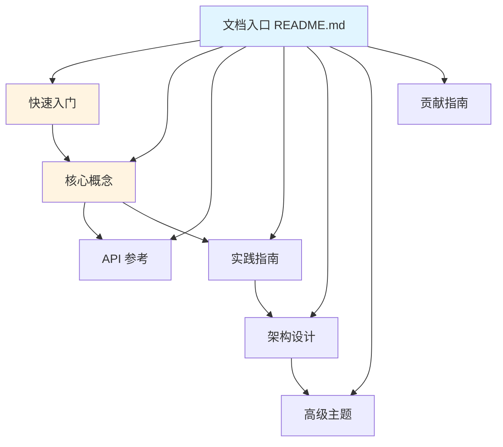
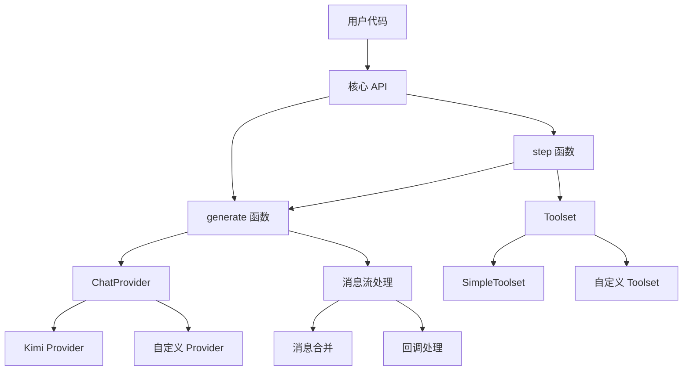
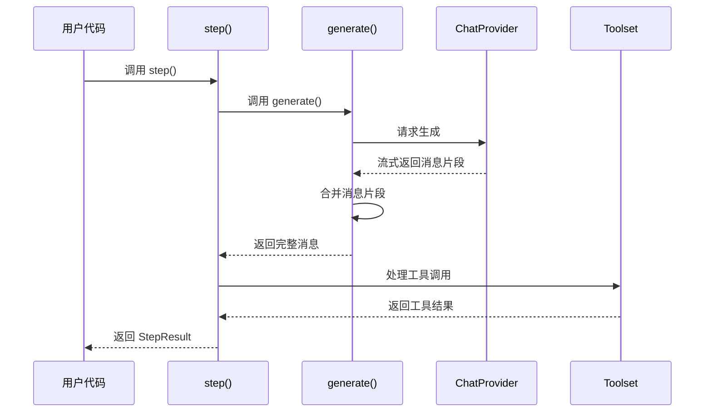

# 设计文档

## 概述

本文档描述了 Kosong 项目中文文档系统的整体设计方案。文档系统将采用模块化的结构，按照用户学习路径和使用场景组织内容，确保新用户能够快速上手，同时为高级用户提供深入的技术细节。

### 设计目标

1. **易于导航**：清晰的文档结构和导航系统，用户能快速找到所需信息
2. **渐进式学习**：从基础到高级，循序渐进的内容组织
3. **实用性强**：提供大量可运行的代码示例和实践指导
4. **易于维护**：统一的格式规范和模块化结构，便于更新和扩展
5. **内容同步**：与代码库保持完全同步，确保准确性

### 目标用户

- **新手用户**：首次接触 Kosong，需要快速入门指导
- **应用开发者**：使用 Kosong 构建 AI Agent 应用的开发者
- **高级用户**：需要深入了解内部实现和扩展框架的开发者
- **贡献者**：希望为项目贡献代码或文档的开发者

## 架构

### 文档目录结构

```
docs/
├── README.md                    # 文档导航入口
├── quick-start.md              # 快速入门指南
├── core-concepts.md            # 核心概念说明
├── architecture.md             # 架构设计文档
├── api-reference/              # API 参考文档目录
│   ├── README.md              # API 文档索引
│   ├── generate.md            # generate 函数文档
│   ├── step.md                # step 函数文档
│   ├── message.md             # Message 模块文档
│   ├── chat-provider.md       # ChatProvider 模块文档
│   └── tooling.md             # Tooling 模块文档
├── guides/                     # 实践指南目录
│   ├── README.md              # 指南索引
│   ├── multi-turn-conversation.md    # 多轮对话指南
│   ├── streaming-output.md           # 流式输出指南
│   ├── custom-tools.md               # 自定义工具指南
│   ├── error-handling.md             # 错误处理指南
│   └── production-deployment.md      # 生产部署指南
├── advanced/                   # 高级主题目录
│   ├── README.md              # 高级主题索引
│   ├── custom-chat-provider.md       # 自定义 ChatProvider
│   ├── message-streaming.md          # 消息流处理机制
│   └── async-tool-execution.md       # 异步工具执行
└── contributing.md             # 贡献指南
```

### 文档层次关系




## 组件和接口

### 1. 文档导航入口 (docs/README.md)

**功能**：作为整个文档系统的入口，提供清晰的导航结构。

**内容结构**：
- 项目简介（简短，1-2 段）
- 文档导航菜单（按学习路径组织）
- 快速链接（常用文档的直达链接）
- 版本信息和更新日志链接

**设计要点**：
- 使用清晰的标题层级
- 提供图标或 emoji 增强可读性
- 按照用户学习路径组织链接顺序

### 2. 快速入门指南 (quick-start.md)

**功能**：帮助新用户在 30 分钟内完成安装并运行第一个示例。

**内容结构**：
1. 环境要求（Python 版本、包管理器）
2. 安装步骤（不超过 5 步）
3. 基础示例
   - 简单对话示例
   - 流式输出示例
   - 工具调用示例
4. 下一步学习建议

**代码示例要求**：
- 所有示例必须完整可运行
- 包含必要的 import 语句
- 提供清晰的注释说明
- 使用真实但可替换的配置（如 API key 占位符）

### 3. 核心概念文档 (core-concepts.md)

**功能**：解释 Kosong 的核心概念和设计理念。

**内容结构**：
1. Kosong 是什么
2. 核心概念
   - Message（消息）
   - ChatProvider（聊天提供者）
   - Tool 和 Toolset（工具和工具集）
   - 流式处理（Streaming）
   - 异步执行（Async Execution）
3. 工作流程图解
4. 与其他框架的对比

**设计要点**：
- 使用 Mermaid 图表展示概念关系
- 每个概念配有简短代码示例
- 避免过深的技术细节

### 4. API 参考文档 (api-reference/)

**功能**：提供完整的 API 文档，包括所有公开接口的详细说明。

**模块划分**：

#### 4.1 核心函数文档
- `generate.md`：`kosong.generate()` 函数
- `step.md`：`kosong.step()` 函数

#### 4.2 消息模块文档 (message.md)
- `Message` 类
- `ContentPart` 及其子类（`TextPart`、`ThinkPart`、`ImageURLPart`、`AudioURLPart`）
- `ToolCall` 和 `ToolCallPart`

#### 4.3 ChatProvider 模块文档 (chat-provider.md)
- `ChatProvider` 协议
- `StreamedMessage` 协议
- `TokenUsage` 数据类
- 内置 Provider（Kimi、Mock 等）
- 异常类型

#### 4.4 Tooling 模块文档 (tooling.md)
- `Tool` 类
- `CallableTool` 和 `CallableTool2` 抽象类
- `ToolOk` 和 `ToolError`
- `Toolset` 协议
- `SimpleToolset` 实现

**每个 API 条目包含**：
- 函数/类签名
- 参数说明（类型、默认值、说明）
- 返回值说明
- 异常说明
- 使用示例（至少 1 个）
- 相关 API 链接


### 5. 实践指南 (guides/)

**功能**：提供实际应用场景的完整示例和最佳实践。

**指南列表**：

#### 5.1 多轮对话指南 (multi-turn-conversation.md)
- 维护对话历史
- 上下文管理
- 对话状态持久化
- 完整的聊天机器人示例

#### 5.2 流式输出指南 (streaming-output.md)
- 流式输出的工作原理
- 实时显示响应内容
- 处理流式工具调用
- 错误处理和重试

#### 5.3 自定义工具指南 (custom-tools.md)
- 创建简单工具（CallableTool2）
- 工具参数验证
- 工具错误处理
- 异步工具实现
- 工具组合和复用

#### 5.4 错误处理指南 (error-handling.md)
- 常见异常类型
- API 错误处理
- 工具执行错误
- 重试策略
- 优雅降级

#### 5.5 生产部署指南 (production-deployment.md)
- 性能优化建议
- 并发处理
- 日志和监控
- API 密钥管理
- 成本控制

**每个指南包含**：
- 场景说明
- 完整代码示例
- 运行说明
- 预期输出
- 常见问题和解决方案
- 最佳实践建议

### 6. 架构设计文档 (architecture.md)

**功能**：深入解释 Kosong 的架构设计和实现原理。

**内容结构**：

#### 6.1 整体架构


#### 6.2 消息流转机制
- 消息的生命周期
- 流式消息的合并策略
- ContentPart 的多态处理
- ToolCall 的增量构建

#### 6.3 工具调用流程


#### 6.4 异步处理机制
- asyncio 的使用
- Future 和 Task 管理
- 并发工具执行
- 取消和清理机制

#### 6.5 错误处理策略
- 异常层次结构
- 错误传播路径
- 资源清理保证

#### 6.6 扩展点设计
- 如何实现自定义 ChatProvider
- 如何实现自定义 Toolset
- 如何扩展 ContentPart 类型


### 7. 高级主题文档 (advanced/)

**功能**：为高级用户提供深入的技术细节和扩展指导。

**主题列表**：

#### 7.1 自定义 ChatProvider (custom-chat-provider.md)
- ChatProvider 协议详解
- StreamedMessage 实现
- 消息格式转换
- 错误处理实现
- 完整的自定义 Provider 示例

#### 7.2 消息流处理机制 (message-streaming.md)
- 流式处理的设计原理
- MergeableMixin 接口
- 消息片段的合并算法
- 性能优化技巧

#### 7.3 异步工具执行 (async-tool-execution.md)
- 工具并发执行机制
- ToolResultFuture 的使用
- 取消和超时处理
- 自定义 Toolset 实现

### 8. 贡献指南 (contributing.md)

**功能**：指导开发者如何为项目做出贡献。

**内容结构**：

#### 8.1 开发环境设置
- 克隆仓库
- 安装依赖（使用 uv）
- 配置开发工具（pyright、ruff）

#### 8.2 代码规范
- 代码风格（遵循 ruff 配置）
- 命名约定
- 类型注解要求
- 文档字符串格式

#### 8.3 测试要求
- 运行测试套件
- 编写单元测试
- 测试覆盖率要求
- 使用 pytest 和 pytest-asyncio

#### 8.4 贡献流程
- 提交 Issue
- Fork 和分支策略
- 提交 Pull Request
- 代码审查流程

#### 8.5 文档贡献
- 文档格式规范
- 如何更新 API 文档
- 如何添加新的指南
- 文档审查标准

## 数据模型

### 文档元数据

每个文档文件应包含以下元数据（在文件开头的注释中）：

```markdown
---
title: 文档标题
description: 文档简短描述
version: 0.23.0
last_updated: 2025-01-15
---
```

### 代码示例格式

所有代码示例应遵循统一格式：

```python
# 示例标题：简短描述示例的目的

import asyncio
# ... 其他必要的 import

# 配置说明（如果需要）
API_KEY = "your_api_key_here"  # 替换为你的 API 密钥

async def main() -> None:
    # 主要逻辑
    ...

# 运行示例
asyncio.run(main())
```

### 术语翻译对照表

为保持文档中技术术语的一致性，建立以下对照表：

| 英文术语 | 中文翻译 | 说明 |
|---------|---------|------|
| Chat Provider | 聊天提供者 | 提供 LLM 服务的抽象接口 |
| Message | 消息 | 对话中的一条消息 |
| Tool | 工具 | AI Agent 可以调用的功能 |
| Toolset | 工具集 | 管理多个工具的容器 |
| Streaming | 流式处理 | 实时接收和处理响应 |
| Content Part | 内容片段 | 消息内容的组成部分 |
| Tool Call | 工具调用 | AI 请求调用工具的指令 |
| Token Usage | Token 用量 | API 调用的 token 消耗统计 |
| Async | 异步 | 异步编程模式 |
| Future | Future 对象 | 异步操作的结果占位符 |


## 错误处理

### 文档错误类型

1. **内容错误**
   - 代码示例无法运行
   - API 签名与实际代码不符
   - 过时的信息

2. **格式错误**
   - Markdown 格式不规范
   - 代码块语言标记缺失
   - 链接失效

3. **翻译错误**
   - 术语翻译不一致
   - 语法错误
   - 表达不清晰

### 错误预防措施

1. **代码验证**
   - 所有代码示例必须经过实际运行验证
   - 使用自动化脚本检查代码示例的语法
   - 定期运行示例代码确保与最新版本兼容

2. **链接检查**
   - 使用工具自动检查文档内部链接
   - 验证外部链接的有效性
   - 定期审查和更新链接

3. **版本同步**
   - 在代码更新时同步更新相关文档
   - 在文档中标注适用的版本号
   - 维护文档变更日志

### 错误报告和修复流程

1. 用户通过 GitHub Issue 报告文档问题
2. 维护者验证问题并标记优先级
3. 分配给相应的文档维护者
4. 修复后提交 PR 并经过审查
5. 合并后更新文档版本信息

## 测试策略

### 文档质量检查

1. **自动化检查**
   - Markdown 格式检查（使用 markdownlint）
   - 代码块语法检查
   - 链接有效性检查
   - 拼写检查

2. **手动审查**
   - 内容准确性审查
   - 代码示例可运行性测试
   - 翻译质量审查
   - 用户体验测试

3. **示例代码测试**
   - 提取文档中的代码示例
   - 在 CI/CD 中自动运行
   - 确保所有示例都能正常工作

### 文档测试清单

每个文档在发布前应通过以下检查：

- [ ] Markdown 格式正确
- [ ] 所有代码块都有语言标记
- [ ] 代码示例已验证可运行
- [ ] 内部链接有效
- [ ] 外部链接有效
- [ ] 术语翻译一致
- [ ] 无语法错误
- [ ] 版本信息正确
- [ ] 更新日期正确

### 用户反馈收集

1. **反馈渠道**
   - GitHub Issues
   - 文档页面底部的反馈表单
   - 社区讨论区

2. **反馈分类**
   - 错误报告
   - 改进建议
   - 新内容请求
   - 翻译问题

3. **反馈处理**
   - 定期审查反馈
   - 优先处理错误报告
   - 评估改进建议的可行性
   - 将常见问题添加到 FAQ

## 文档格式规范

### Markdown 格式标准

1. **标题层级**
   - 使用 `#` 到 `####`，最多四级标题
   - 标题前后保留空行
   - 标题使用中文，简洁明了

2. **代码块**
   - 始终指定语言标记：` ```python `
   - 代码块前后保留空行
   - 代码缩进使用 4 个空格

3. **列表**
   - 有序列表使用 `1. 2. 3.`
   - 无序列表使用 `-`
   - 列表项之间不留空行（除非包含多段内容）

4. **链接**
   - 内部链接使用相对路径：`[快速入门](./quick-start.md)`
   - 外部链接使用完整 URL
   - 链接文本应清晰描述目标内容

5. **强调**
   - 使用 `**粗体**` 强调重要内容
   - 使用 `*斜体*` 表示术语或引用
   - 使用 `` `代码` `` 表示代码片段或命令

6. **图表**
   - 优先使用 Mermaid 图表
   - 图表前后保留空行
   - 为图表添加简短说明

### 文件命名规范

1. **文件名格式**
   - 使用小写字母
   - 单词之间使用连字符 `-`
   - 使用 `.md` 扩展名
   - 示例：`quick-start.md`、`api-reference.md`

2. **目录命名**
   - 使用小写字母
   - 单词之间使用连字符 `-`
   - 避免使用特殊字符
   - 示例：`api-reference/`、`guides/`

### 中文写作规范

1. **标点符号**
   - 使用中文标点符号（，。！？）
   - 英文和数字前后加空格（可选，但保持一致）
   - 代码和中文之间加空格

2. **术语使用**
   - 技术术语首次出现时提供英文原文
   - 后续使用统一的中文翻译
   - 保持术语翻译的一致性

3. **语言风格**
   - 使用简洁、专业的技术语言
   - 避免口语化表达
   - 使用主动语态
   - 保持客观中立的语气

## 维护和更新策略

### 文档版本管理

1. **版本号规则**
   - 文档版本与代码版本保持一致
   - 在文档元数据中标注版本号
   - 重大更新时更新版本号

2. **变更日志**
   - 维护 `CHANGELOG.md` 记录文档变更
   - 记录新增、修改和删除的内容
   - 按版本和日期组织

### 定期审查计划

1. **每月审查**
   - 检查用户反馈
   - 修复已知错误
   - 更新过时内容

2. **每季度审查**
   - 全面审查文档质量
   - 评估文档结构是否需要调整
   - 添加新的实践指南

3. **版本发布审查**
   - 在每次代码版本发布前审查文档
   - 确保文档与新版本同步
   - 更新所有相关示例

### 文档废弃策略

1. **标记废弃内容**
   - 在文档顶部添加废弃警告
   - 提供替代方案的链接
   - 说明废弃原因和时间表

2. **归档旧文档**
   - 将废弃文档移至 `docs/archive/` 目录
   - 保留历史版本供参考
   - 在主文档中移除相关链接

3. **清理过时内容**
   - 定期清理已完全废弃的内容
   - 保留重要的历史文档
   - 更新所有相关链接

## 实施优先级

根据需求的重要性和依赖关系，建议按以下顺序实施文档：

1. **第一阶段（核心文档）**
   - 文档导航入口 (README.md)
   - 快速入门指南 (quick-start.md)
   - 核心概念文档 (core-concepts.md)

2. **第二阶段（API 文档）**
   - API 参考索引
   - 核心函数文档（generate、step）
   - 消息模块文档
   - ChatProvider 模块文档
   - Tooling 模块文档

3. **第三阶段（实践指南）**
   - 多轮对话指南
   - 流式输出指南
   - 自定义工具指南
   - 错误处理指南

4. **第四阶段（高级内容）**
   - 架构设计文档
   - 高级主题文档
   - 生产部署指南

5. **第五阶段（贡献文档）**
   - 贡献指南
   - 开发环境设置
   - 测试指南

## 成功指标

文档系统的成功可以通过以下指标衡量：

1. **用户满意度**
   - 用户反馈评分 ≥ 4.5/5
   - 文档相关 Issue 数量下降 50%

2. **使用效率**
   - 新用户完成快速入门时间 ≤ 30 分钟
   - 文档搜索命中率 ≥ 80%

3. **内容质量**
   - 代码示例可运行率 = 100%
   - 链接有效率 ≥ 95%
   - 文档更新延迟 ≤ 7 天（相对于代码更新）

4. **社区参与**
   - 文档贡献者数量增长
   - 文档相关 PR 数量增加
