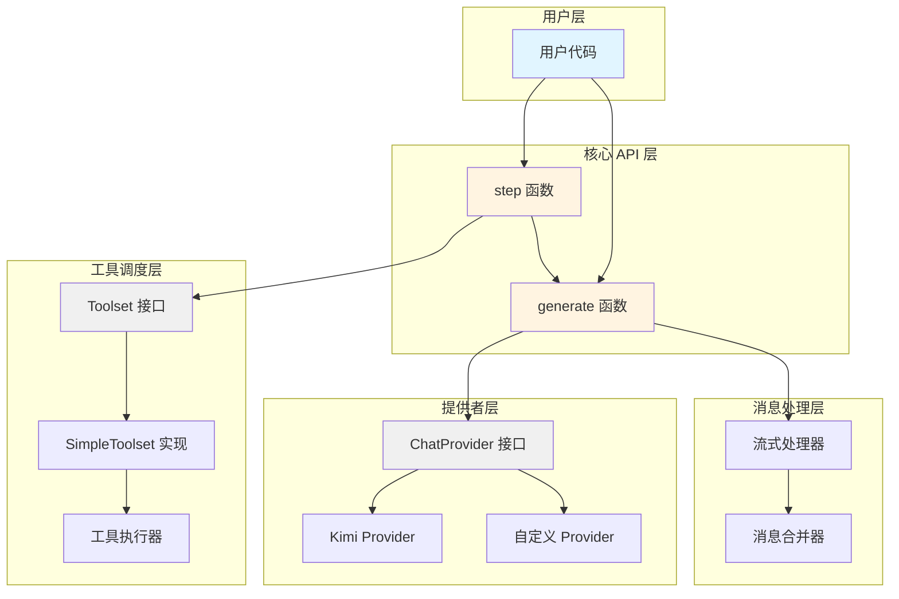
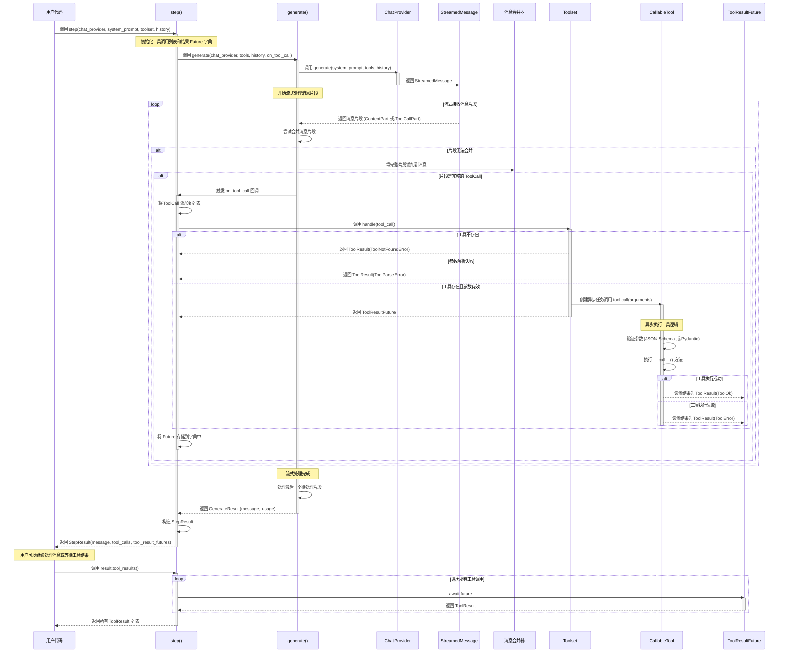

# 架构设计

本文档深入解释 Kosong 的架构设计和实现原理，帮助高级用户理解框架的内部机制，以便扩展框架或贡献代码。

## 整体架构

Kosong 采用分层架构设计，将 LLM 交互、消息处理、工具调度等功能解耦，提供清晰的抽象层次。

### 架构层次



### 核心组件

#### 1. 核心 API 层

**generate 函数**
- 负责与 ChatProvider 交互，生成一条完整的消息
- 处理流式响应，将消息片段合并为完整消息
- 提供回调机制，实时通知消息片段和工具调用

**step 函数**
- 在 generate 基础上增加工具调度功能
- 管理工具调用的生命周期
- 返回 StepResult，包含消息、工具调用和工具结果的 Future

#### 2. 消息处理层

**Message 和 ContentPart**
- Message 表示对话中的一条消息
- ContentPart 是消息内容的组成部分，支持多态（文本、图片、音频、思考等）
- 实现 MergeableMixin 接口，支持流式消息的增量合并

**ToolCall 和 ToolCallPart**
- ToolCall 表示完整的工具调用请求
- ToolCallPart 表示工具调用的片段，用于流式构建

#### 3. 工具调度层

**Toolset 接口**
- 定义工具集的标准接口
- 提供 tools 属性和 handle 方法

**SimpleToolset 实现**
- 支持并发执行多个工具调用
- 使用 asyncio.Task 管理异步工具执行
- 提供工具注册和查找机制

**CallableTool 和 CallableTool2**
- 抽象基类，简化工具实现
- CallableTool2 提供类型安全的参数验证（基于 Pydantic）

#### 4. 提供者层

**ChatProvider 接口**
- 统一不同 LLM 服务商的 API
- 定义 generate 方法，返回 StreamedMessage
- 支持思考模式配置（with_thinking）

**内置 Provider**
- Kimi Provider：支持 Moonshot AI 的 Kimi 模型
- Mock Provider：用于测试和开发

### 数据流向


### 设计原则

1. **接口优先**：使用 Protocol 定义接口，支持鸭子类型和灵活扩展
2. **异步优先**：全面采用 asyncio，支持高并发场景
3. **流式优先**：优先支持流式处理，提升用户体验
4. **类型安全**：使用 Pydantic 和类型注解，提供编译时类型检查
5. **错误透明**：定义清晰的异常层次，错误信息传递到用户层

## 工具调用流程

工具调用是 Kosong 的核心功能之一，允许 LLM 在生成响应时调用外部工具来完成特定任务。本节详细说明工具调用的完整流程，从用户发起请求到工具执行完成的各个阶段。

### 工具调用时序图



### 工具调用的各个阶段

#### 1. 初始化阶段

当用户调用 `step()` 函数时，系统会进行以下初始化：

- 创建空的工具调用列表 `tool_calls`，用于记录所有工具调用
- 创建工具结果 Future 字典 `tool_result_futures`，用于管理异步工具执行
- 定义 `on_tool_call` 回调函数，用于处理流式接收到的工具调用

```python
tool_calls: list[ToolCall] = []
tool_result_futures: dict[str, ToolResultFuture] = {}

async def on_tool_call(tool_call: ToolCall):
    tool_calls.append(tool_call)
    result = toolset.handle(tool_call)
    # 处理同步或异步结果...
```

#### 2. 消息生成阶段

`step()` 调用 `generate()` 函数，后者负责与 ChatProvider 交互：

- 将 Toolset 中的工具定义传递给 ChatProvider
- ChatProvider 返回 StreamedMessage，开始流式传输消息片段
- 消息片段可能是 ContentPart（文本、图片等）或 ToolCallPart（工具调用片段）

#### 3. 流式合并阶段

`generate()` 函数实时处理流式消息片段：

```python
pending_part: StreamedMessagePart | None = None

async for part in stream:
    if pending_part is None:
        pending_part = part
    elif not pending_part.merge_in_place(part):
        # 无法合并，说明是新的片段
        _message_append(message, pending_part)
        if isinstance(pending_part, ToolCall) and on_tool_call:
            await callback(on_tool_call, pending_part)
        pending_part = part
```

**合并策略**：
- ToolCallPart 可以增量合并，逐步构建完整的 ToolCall
- 当接收到无法合并的新片段时，说明前一个片段已完整
- 完整的 ToolCall 会触发 `on_tool_call` 回调

#### 4. 工具调度阶段

当完整的 ToolCall 被识别后，`on_tool_call` 回调会被触发：

```python
async def on_tool_call(tool_call: ToolCall):
    tool_calls.append(tool_call)
    result = toolset.handle(tool_call)
    
    if isinstance(result, ToolResult):
        # 同步结果（如工具不存在、参数错误）
        future = ToolResultFuture()
        future.set_result(result)
        tool_result_futures[tool_call.id] = future
    else:
        # 异步结果（正常工具执行）
        tool_result_futures[tool_call.id] = result
```

**Toolset 处理逻辑**（以 SimpleToolset 为例）：

1. **工具查找**：根据工具名称在工具字典中查找
   - 如果工具不存在，立即返回 `ToolResult(ToolNotFoundError)`

2. **参数解析**：将 JSON 字符串解析为 Python 对象
   - 如果解析失败，立即返回 `ToolResult(ToolParseError)`

3. **异步执行**：创建 asyncio.Task 执行工具
   ```python
   async def _call():
       try:
           ret = await tool.call(arguments)
           return ToolResult(tool_call.id, ret)
       except Exception as e:
           return ToolResult(tool_call.id, ToolRuntimeError(str(e)))
   
   return asyncio.create_task(_call())
   ```

#### 5. 工具执行阶段

工具执行在独立的异步任务中进行，不会阻塞消息生成：

**CallableTool 执行流程**：
```python
async def call(self, arguments: JsonType) -> ToolReturnType:
    # 1. 参数验证（JSON Schema）
    jsonschema.validate(arguments, self.parameters)
    
    # 2. 参数解包
    if isinstance(arguments, list):
        ret = await self.__call__(*arguments)
    elif isinstance(arguments, dict):
        ret = await self.__call__(**arguments)
    else:
        ret = await self.__call__(arguments)
    
    # 3. 返回结果
    return ret
```

**CallableTool2 执行流程**：
```python
async def call(self, arguments: JsonType) -> ToolReturnType:
    # 1. 参数验证（Pydantic）
    params = self.params.model_validate(arguments)
    
    # 2. 调用工具
    ret = await self.__call__(params)
    
    # 3. 返回结果
    return ret
```

#### 6. 结果收集阶段

当 `generate()` 完成后，`step()` 返回 StepResult：

```python
return StepResult(
    result.id,
    result.message,
    result.usage,
    tool_calls,
    tool_result_futures,
)
```

用户可以通过 `await result.tool_results()` 等待所有工具执行完成：

```python
async def tool_results(self) -> list[ToolResult]:
    results: list[ToolResult] = []
    for tool_call in self.tool_calls:
        future = self._tool_result_futures.pop(tool_call.id)
        result = await future  # 等待工具执行完成
        results.append(result)
    return results
```

**错误处理**：
- 如果某个工具执行失败，会取消所有剩余的 Future
- 使用 `asyncio.gather(..., return_exceptions=True)` 确保资源清理

### 并发执行机制

Kosong 支持多个工具调用的并发执行：

1. **非阻塞调度**：`toolset.handle()` 立即返回 Future，不等待工具执行完成
2. **并行执行**：多个工具调用会创建多个 asyncio.Task，并行执行
3. **按序收集**：`tool_results()` 按照工具调用的顺序等待结果，保证结果顺序与调用顺序一致

**示例**：
```python
# 假设 LLM 同时调用了 3 个工具
result = await step(...)
# 此时 3 个工具已经在后台并行执行

# 等待所有工具执行完成（按调用顺序返回）
tool_results = await result.tool_results()
```

### 错误处理策略

工具调用过程中可能出现多种错误，Kosong 采用分层错误处理策略：

#### 1. 工具查找错误
- **错误类型**：`ToolNotFoundError`
- **处理方式**：立即返回 ToolResult，不创建异步任务
- **错误信息**：包含工具名称，帮助 LLM 理解问题

#### 2. 参数解析错误
- **错误类型**：`ToolParseError`
- **处理方式**：立即返回 ToolResult，不创建异步任务
- **错误信息**：包含 JSON 解析错误详情

#### 3. 参数验证错误
- **错误类型**：`ToolValidateError`
- **处理方式**：在工具执行任务中返回 ToolError
- **错误信息**：包含 JSON Schema 或 Pydantic 验证错误

#### 4. 工具运行时错误
- **错误类型**：`ToolRuntimeError`
- **处理方式**：捕获工具执行中的所有异常，包装为 ToolError
- **错误信息**：包含原始异常信息

#### 5. 取消和清理
- **场景**：用户取消操作或 ChatProvider 错误
- **处理方式**：
  ```python
  except (ChatProviderError, asyncio.CancelledError):
      # 取消所有工具执行任务
      for future in tool_result_futures.values():
          future.cancel()
      await asyncio.gather(*tool_result_futures.values(), return_exceptions=True)
      raise
  ```

### 扩展点

工具调用系统提供了多个扩展点：

#### 1. 自定义 Toolset
实现 `Toolset` 协议，自定义工具调度逻辑：
```python
class CustomToolset(Toolset):
    @property
    def tools(self) -> list[Tool]:
        # 返回工具定义列表
        ...
    
    def handle(self, tool_call: ToolCall) -> HandleResult:
        # 自定义工具调度逻辑
        # 可以实现工具缓存、限流、日志等功能
        ...
```

#### 2. 自定义工具类型
继承 `CallableTool` 或 `CallableTool2`，实现特定类型的工具：
```python
class DatabaseTool(CallableTool2[QueryParams]):
    async def __call__(self, params: QueryParams) -> ToolReturnType:
        # 实现数据库查询逻辑
        ...
```

#### 3. 工具结果回调
使用 `on_tool_result` 回调实时监控工具执行：
```python
def on_tool_result(result: ToolResult):
    print(f"Tool {result.tool_call_id} completed")

result = await step(
    ...,
    on_tool_result=on_tool_result,
)
```
