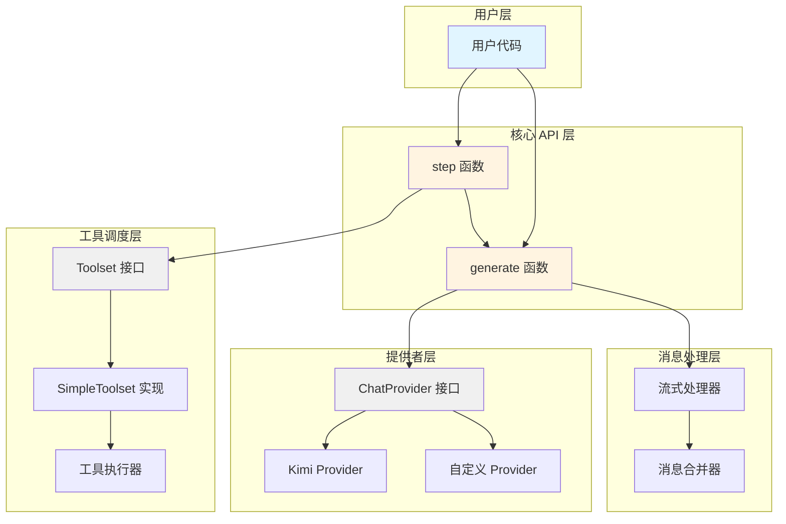
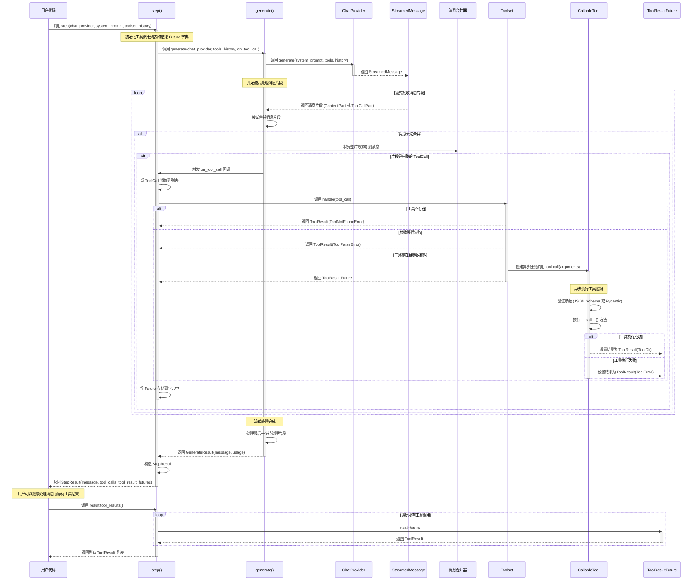

# 架构设计

本文档深入解释 Kosong 的架构设计和实现原理，帮助高级用户理解框架的内部机制，以便扩展框架或贡献代码。

## 整体架构

Kosong 采用分层架构设计，将 LLM 交互、消息处理、工具调度等功能解耦，提供清晰的抽象层次。

### 架构层次



### 核心组件

#### 1. 核心 API 层

**generate 函数**
- 负责与 ChatProvider 交互，生成一条完整的消息
- 处理流式响应，将消息片段合并为完整消息
- 提供回调机制，实时通知消息片段和工具调用

**step 函数**
- 在 generate 基础上增加工具调度功能
- 管理工具调用的生命周期
- 返回 StepResult，包含消息、工具调用和工具结果的 Future

#### 2. 消息处理层

**Message 和 ContentPart**
- Message 表示对话中的一条消息
- ContentPart 是消息内容的组成部分，支持多态（文本、图片、音频、思考等）
- 实现 MergeableMixin 接口，支持流式消息的增量合并

**ToolCall 和 ToolCallPart**
- ToolCall 表示完整的工具调用请求
- ToolCallPart 表示工具调用的片段，用于流式构建

#### 3. 工具调度层

**Toolset 接口**
- 定义工具集的标准接口
- 提供 tools 属性和 handle 方法

**SimpleToolset 实现**
- 支持并发执行多个工具调用
- 使用 asyncio.Task 管理异步工具执行
- 提供工具注册和查找机制

**CallableTool 和 CallableTool2**
- 抽象基类，简化工具实现
- CallableTool2 提供类型安全的参数验证（基于 Pydantic）

#### 4. 提供者层

**ChatProvider 接口**
- 统一不同 LLM 服务商的 API
- 定义 generate 方法，返回 StreamedMessage
- 支持思考模式配置（with_thinking）

**内置 Provider**
- Kimi Provider：支持 Moonshot AI 的 Kimi 模型
- Mock Provider：用于测试和开发

### 数据流向


### 设计原则

1. **接口优先**：使用 Protocol 定义接口，支持鸭子类型和灵活扩展
2. **异步优先**：全面采用 asyncio，支持高并发场景
3. **流式优先**：优先支持流式处理，提升用户体验
4. **类型安全**：使用 Pydantic 和类型注解，提供编译时类型检查
5. **错误透明**：定义清晰的异常层次，错误信息传递到用户层

## 工具调用流程

工具调用是 Kosong 的核心功能之一，允许 LLM 在生成响应时调用外部工具来完成特定任务。本节详细说明工具调用的完整流程，从用户发起请求到工具执行完成的各个阶段。

### 工具调用时序图



### 工具调用的各个阶段

#### 1. 初始化阶段

当用户调用 `step()` 函数时，系统会进行以下初始化：

- 创建空的工具调用列表 `tool_calls`，用于记录所有工具调用
- 创建工具结果 Future 字典 `tool_result_futures`，用于管理异步工具执行
- 定义 `on_tool_call` 回调函数，用于处理流式接收到的工具调用

```python
tool_calls: list[ToolCall] = []
tool_result_futures: dict[str, ToolResultFuture] = {}

async def on_tool_call(tool_call: ToolCall):
    tool_calls.append(tool_call)
    result = toolset.handle(tool_call)
    # 处理同步或异步结果...
```

#### 2. 消息生成阶段

`step()` 调用 `generate()` 函数，后者负责与 ChatProvider 交互：

- 将 Toolset 中的工具定义传递给 ChatProvider
- ChatProvider 返回 StreamedMessage，开始流式传输消息片段
- 消息片段可能是 ContentPart（文本、图片等）或 ToolCallPart（工具调用片段）

#### 3. 流式合并阶段

`generate()` 函数实时处理流式消息片段：

```python
pending_part: StreamedMessagePart | None = None

async for part in stream:
    if pending_part is None:
        pending_part = part
    elif not pending_part.merge_in_place(part):
        # 无法合并，说明是新的片段
        _message_append(message, pending_part)
        if isinstance(pending_part, ToolCall) and on_tool_call:
            await callback(on_tool_call, pending_part)
        pending_part = part
```

**合并策略**：
- ToolCallPart 可以增量合并，逐步构建完整的 ToolCall
- 当接收到无法合并的新片段时，说明前一个片段已完整
- 完整的 ToolCall 会触发 `on_tool_call` 回调

#### 4. 工具调度阶段

当完整的 ToolCall 被识别后，`on_tool_call` 回调会被触发：

```python
async def on_tool_call(tool_call: ToolCall):
    tool_calls.append(tool_call)
    result = toolset.handle(tool_call)
    
    if isinstance(result, ToolResult):
        # 同步结果（如工具不存在、参数错误）
        future = ToolResultFuture()
        future.set_result(result)
        tool_result_futures[tool_call.id] = future
    else:
        # 异步结果（正常工具执行）
        tool_result_futures[tool_call.id] = result
```

**Toolset 处理逻辑**（以 SimpleToolset 为例）：

1. **工具查找**：根据工具名称在工具字典中查找
   - 如果工具不存在，立即返回 `ToolResult(ToolNotFoundError)`

2. **参数解析**：将 JSON 字符串解析为 Python 对象
   - 如果解析失败，立即返回 `ToolResult(ToolParseError)`

3. **异步执行**：创建 asyncio.Task 执行工具
   ```python
   async def _call():
       try:
           ret = await tool.call(arguments)
           return ToolResult(tool_call.id, ret)
       except Exception as e:
           return ToolResult(tool_call.id, ToolRuntimeError(str(e)))
   
   return asyncio.create_task(_call())
   ```

#### 5. 工具执行阶段

工具执行在独立的异步任务中进行，不会阻塞消息生成：

**CallableTool 执行流程**：
```python
async def call(self, arguments: JsonType) -> ToolReturnType:
    # 1. 参数验证（JSON Schema）
    jsonschema.validate(arguments, self.parameters)
    
    # 2. 参数解包
    if isinstance(arguments, list):
        ret = await self.__call__(*arguments)
    elif isinstance(arguments, dict):
        ret = await self.__call__(**arguments)
    else:
        ret = await self.__call__(arguments)
    
    # 3. 返回结果
    return ret
```

**CallableTool2 执行流程**：
```python
async def call(self, arguments: JsonType) -> ToolReturnType:
    # 1. 参数验证（Pydantic）
    params = self.params.model_validate(arguments)
    
    # 2. 调用工具
    ret = await self.__call__(params)
    
    # 3. 返回结果
    return ret
```

#### 6. 结果收集阶段

当 `generate()` 完成后，`step()` 返回 StepResult：

```python
return StepResult(
    result.id,
    result.message,
    result.usage,
    tool_calls,
    tool_result_futures,
)
```

用户可以通过 `await result.tool_results()` 等待所有工具执行完成：

```python
async def tool_results(self) -> list[ToolResult]:
    results: list[ToolResult] = []
    for tool_call in self.tool_calls:
        future = self._tool_result_futures.pop(tool_call.id)
        result = await future  # 等待工具执行完成
        results.append(result)
    return results
```

**错误处理**：
- 如果某个工具执行失败，会取消所有剩余的 Future
- 使用 `asyncio.gather(..., return_exceptions=True)` 确保资源清理

### 并发执行机制

Kosong 支持多个工具调用的并发执行：

1. **非阻塞调度**：`toolset.handle()` 立即返回 Future，不等待工具执行完成
2. **并行执行**：多个工具调用会创建多个 asyncio.Task，并行执行
3. **按序收集**：`tool_results()` 按照工具调用的顺序等待结果，保证结果顺序与调用顺序一致

**示例**：
```python
# 假设 LLM 同时调用了 3 个工具
result = await step(...)
# 此时 3 个工具已经在后台并行执行

# 等待所有工具执行完成（按调用顺序返回）
tool_results = await result.tool_results()
```

### 错误处理策略

工具调用过程中可能出现多种错误，Kosong 采用分层错误处理策略：

#### 1. 工具查找错误
- **错误类型**：`ToolNotFoundError`
- **处理方式**：立即返回 ToolResult，不创建异步任务
- **错误信息**：包含工具名称，帮助 LLM 理解问题

#### 2. 参数解析错误
- **错误类型**：`ToolParseError`
- **处理方式**：立即返回 ToolResult，不创建异步任务
- **错误信息**：包含 JSON 解析错误详情

#### 3. 参数验证错误
- **错误类型**：`ToolValidateError`
- **处理方式**：在工具执行任务中返回 ToolError
- **错误信息**：包含 JSON Schema 或 Pydantic 验证错误

#### 4. 工具运行时错误
- **错误类型**：`ToolRuntimeError`
- **处理方式**：捕获工具执行中的所有异常，包装为 ToolError
- **错误信息**：包含原始异常信息

#### 5. 取消和清理
- **场景**：用户取消操作或 ChatProvider 错误
- **处理方式**：
  ```python
  except (ChatProviderError, asyncio.CancelledError):
      # 取消所有工具执行任务
      for future in tool_result_futures.values():
          future.cancel()
      await asyncio.gather(*tool_result_futures.values(), return_exceptions=True)
      raise
  ```

### 扩展点

工具调用系统提供了多个扩展点：

#### 1. 自定义 Toolset
实现 `Toolset` 协议，自定义工具调度逻辑：
```python
class CustomToolset(Toolset):
    @property
    def tools(self) -> list[Tool]:
        # 返回工具定义列表
        ...
    
    def handle(self, tool_call: ToolCall) -> HandleResult:
        # 自定义工具调度逻辑
        # 可以实现工具缓存、限流、日志等功能
        ...
```

#### 2. 自定义工具类型
继承 `CallableTool` 或 `CallableTool2`，实现特定类型的工具：
```python
class DatabaseTool(CallableTool2[QueryParams]):
    async def __call__(self, params: QueryParams) -> ToolReturnType:
        # 实现数据库查询逻辑
        ...
```

#### 3. 工具结果回调
使用 `on_tool_result` 回调实时监控工具执行：
```python
def on_tool_result(result: ToolResult):
    print(f"Tool {result.tool_call_id} completed")

result = await step(
    ...,
    on_tool_result=on_tool_result,
)
```


### 扩展点

工具调用系统提供了多个扩展点：

#### 1. 自定义 Toolset
实现 `Toolset` 协议，自定义工具调度逻辑：
```python
class CustomToolset(Toolset):
    @property
    def tools(self) -> list[Tool]:
        # 返回工具定义列表
        ...
    
    def handle(self, tool_call: ToolCall) -> HandleResult:
        # 自定义工具调度逻辑
        # 可以实现工具缓存、限流、日志等功能
        ...
```

#### 2. 自定义工具类型
继承 `CallableTool` 或 `CallableTool2`，实现特定类型的工具：
```python
class DatabaseTool(CallableTool2[QueryParams]):
    async def __call__(self, params: QueryParams) -> ToolReturnType:
        # 实现数据库查询逻辑
        ...
```

#### 3. 工具结果回调
使用 `on_tool_result` 回调实时监控工具执行：
```python
def on_tool_result(result: ToolResult):
    print(f"Tool {result.tool_call_id} completed")

result = await step(
    ...,
    on_tool_result=on_tool_result,
)
```

## 异步处理机制

Kosong 全面采用 Python 的 asyncio 库实现异步处理，支持高并发的 LLM 交互和工具调用。本节详细说明 asyncio 的使用方式、Future 和 Task 的管理机制、并发工具执行的实现，以及取消和清理机制。

### asyncio 的使用

Kosong 的所有核心 API 都是异步函数，使用 `async def` 定义，需要通过 `await` 调用：

```python
import asyncio
from kosong import step
from kosong.chat_provider.kimi import Kimi
from kosong.message import Message
from kosong.tooling.simple import SimpleToolset

async def main():
    kimi = Kimi(api_key="your_key", model="kimi-k2-turbo-preview")
    toolset = SimpleToolset()
    history = [Message(role="user", content="Hello")]
    
    # 所有核心函数都是异步的
    result = await step(kimi, "You are helpful", toolset, history)
    print(result.message)

# 使用 asyncio.run() 启动异步程序
asyncio.run(main())
```

#### 异步函数的层次结构

Kosong 的异步调用链如下：

1. **用户层**：`await step()` 或 `await generate()`
2. **核心层**：`await chat_provider.generate()` 返回异步迭代器
3. **流式处理**：`async for part in stream` 逐个接收消息片段
4. **工具执行**：`asyncio.create_task()` 创建并发任务
5. **结果收集**：`await result.tool_results()` 等待所有工具完成

这种设计确保了整个调用链都是非阻塞的，可以高效处理多个并发请求。


### Future 和 Task 管理

Kosong 使用 `asyncio.Future` 和 `asyncio.Task` 来管理异步工具执行，实现非阻塞的工具调度和结果收集。

#### ToolResultFuture 的设计

`ToolResultFuture` 是 `asyncio.Future[ToolResult]` 的类型别名，用于表示工具执行的异步结果：

```python
from asyncio import Future
from kosong.tooling import ToolResult

type ToolResultFuture = Future[ToolResult]
```

**使用场景**：

1. **同步错误**：工具不存在或参数解析失败时，立即创建已完成的 Future
   ```python
   if tool_call.function.name not in self._tool_dict:
       future = ToolResultFuture()
       future.set_result(ToolResult(tool_call.id, ToolNotFoundError(...)))
       return future
   ```

2. **异步执行**：工具正常执行时，返回 Task（Task 是 Future 的子类）
   ```python
   async def _call():
       try:
           ret = await tool.call(arguments)
           return ToolResult(tool_call.id, ret)
       except Exception as e:
           return ToolResult(tool_call.id, ToolRuntimeError(str(e)))
   
   return asyncio.create_task(_call())  # 返回 Task[ToolResult]
   ```

#### Task 的创建和管理

在 `SimpleToolset.handle()` 方法中，使用 `asyncio.create_task()` 创建工具执行任务：

```python
def handle(self, tool_call: ToolCall) -> HandleResult:
    # 1. 查找工具
    if tool_call.function.name not in self._tool_dict:
        return ToolResult(tool_call.id, ToolNotFoundError(...))
    
    tool = self._tool_dict[tool_call.function.name]
    
    # 2. 解析参数
    try:
        arguments = json.loads(tool_call.function.arguments or "{}")
    except json.JSONDecodeError as e:
        return ToolResult(tool_call.id, ToolParseError(str(e)))
    
    # 3. 创建异步任务
    async def _call():
        try:
            ret = await tool.call(arguments)
            return ToolResult(tool_call.id, ret)
        except Exception as e:
            return ToolResult(tool_call.id, ToolRuntimeError(str(e)))
    
    return asyncio.create_task(_call())  # 立即返回，不等待执行完成
```

**关键特性**：

- `create_task()` 立即返回，不阻塞当前协程
- Task 在后台并发执行，不影响消息生成
- 多个工具调用会创建多个 Task，实现真正的并发

#### Future 字典的管理

`step()` 函数使用字典管理所有工具调用的 Future：

```python
async def step(...) -> StepResult:
    tool_calls: list[ToolCall] = []
    tool_result_futures: dict[str, ToolResultFuture] = {}
    
    async def on_tool_call(tool_call: ToolCall):
        tool_calls.append(tool_call)
        result = toolset.handle(tool_call)
        
        if isinstance(result, ToolResult):
            # 同步结果：创建已完成的 Future
            future = ToolResultFuture()
            future.set_result(result)
            tool_result_futures[tool_call.id] = future
        else:
            # 异步结果：直接存储 Task
            tool_result_futures[tool_call.id] = result
    
    # ... 生成消息和调用工具 ...
    
    return StepResult(..., tool_result_futures)
```

**字典的作用**：

- 以工具调用 ID 为键，快速查找对应的 Future
- 支持按调用顺序收集结果
- 便于统一管理和清理


### 并发工具执行机制

Kosong 的工具执行机制支持多个工具调用的真正并发执行，充分利用 asyncio 的并发能力。

#### 并发执行的实现

当 LLM 在一条消息中调用多个工具时，Kosong 会并发执行这些工具：

```python
# 假设 LLM 同时调用了 3 个工具
result = await step(...)

# 此时 3 个工具已经在后台并行执行
# tool_result_futures 包含 3 个 Task，每个都在独立运行

# 等待所有工具执行完成（按调用顺序返回结果）
tool_results = await result.tool_results()
```

**并发执行的时间线**：

```
时间轴：
t0: step() 开始
t1: generate() 开始流式接收消息
t2: 接收到 ToolCall #1 → 创建 Task #1（开始执行）
t3: 接收到 ToolCall #2 → 创建 Task #2（开始执行）
t4: 接收到 ToolCall #3 → 创建 Task #3（开始执行）
t5: generate() 完成，返回 StepResult
    ├─ Task #1 仍在执行
    ├─ Task #2 仍在执行
    └─ Task #3 仍在执行
t6: 用户调用 result.tool_results()
t7: 等待 Task #1 完成 → 返回结果 #1
t8: 等待 Task #2 完成 → 返回结果 #2
t9: 等待 Task #3 完成 → 返回结果 #3
t10: tool_results() 返回所有结果
```

#### 结果收集的顺序保证

`StepResult.tool_results()` 方法按照工具调用的顺序收集结果：

```python
async def tool_results(self) -> list[ToolResult]:
    """按调用顺序返回所有工具结果"""
    if not self._tool_result_futures:
        return []
    
    try:
        results: list[ToolResult] = []
        for tool_call in self.tool_calls:  # 按调用顺序遍历
            future = self._tool_result_futures.pop(tool_call.id)
            result = await future  # 等待该工具完成
            results.append(result)
        return results
    finally:
        # 如果出现异常，取消所有剩余的 Future
        for future in self._tool_result_futures.values():
            future.cancel()
        await asyncio.gather(*self._tool_result_futures.values(), return_exceptions=True)
```

**关键特性**：

- 虽然工具并发执行，但结果按调用顺序返回
- 如果工具 #1 执行时间较长，会等待它完成后再返回
- 如果工具 #2 先完成，会缓存结果直到轮到它返回

#### 并发性能优势

并发执行可以显著提升性能，特别是在工具涉及 I/O 操作时：

**串行执行**（假设每个工具耗时 1 秒）：
```
Tool #1: [====] 1s
Tool #2:       [====] 1s
Tool #3:             [====] 1s
总耗时: 3 秒
```

**并发执行**（Kosong 的实现）：
```
Tool #1: [====] 1s
Tool #2: [====] 1s
Tool #3: [====] 1s
总耗时: 1 秒
```

#### 实时回调机制

Kosong 支持通过回调实时监控工具执行完成：

```python
def on_tool_result(result: ToolResult):
    print(f"Tool {result.tool_call_id} completed")
    if isinstance(result.result, ToolOk):
        print(f"Output: {result.result.output}")

result = await step(
    ...,
    on_tool_result=on_tool_result,  # 每个工具完成时立即调用
)
```

**回调的实现**：

```python
def future_done_callback(future: ToolResultFuture):
    if on_tool_result:
        try:
            result = future.result()
            on_tool_result(result)
        except asyncio.CancelledError:
            return

# 为每个 Future 添加回调
async def on_tool_call(tool_call: ToolCall):
    # ...
    if isinstance(result, ToolResult):
        future = ToolResultFuture()
        future.add_done_callback(future_done_callback)
        future.set_result(result)
    else:
        result.add_done_callback(future_done_callback)
```

这样，工具一旦完成就会立即触发回调，无需等待所有工具执行完成。


### 取消和清理机制

Kosong 实现了完善的取消和清理机制，确保在异常情况下不会留下悬挂的任务或资源泄漏。

#### 取消的触发场景

取消机制会在以下情况下触发：

1. **ChatProvider 错误**：API 连接失败、超时、返回错误状态码等
2. **用户取消**：用户主动取消 asyncio 任务（`task.cancel()`）
3. **工具执行异常**：某个工具执行失败，需要取消其他工具
4. **程序退出**：应用程序关闭时清理资源

#### step() 函数的取消处理

`step()` 函数在 `generate()` 阶段捕获异常并清理资源：

```python
async def step(...) -> StepResult:
    tool_calls: list[ToolCall] = []
    tool_result_futures: dict[str, ToolResultFuture] = {}
    
    # ... 定义 on_tool_call 回调 ...
    
    try:
        result = await generate(
            chat_provider,
            system_prompt,
            toolset.tools,
            history,
            on_message_part=on_message_part,
            on_tool_call=on_tool_call,
        )
    except (ChatProviderError, asyncio.CancelledError):
        # 1. 移除所有回调，避免在取消时触发
        for future in tool_result_futures.values():
            future.remove_done_callback(future_done_callback)
        
        # 2. 取消所有工具执行任务
        for future in tool_result_futures.values():
            future.cancel()
        
        # 3. 等待所有任务完成清理（忽略异常）
        await asyncio.gather(*tool_result_futures.values(), return_exceptions=True)
        
        # 4. 重新抛出原始异常
        raise
    
    return StepResult(...)
```

**清理步骤说明**：

1. **移除回调**：防止在取消过程中触发 `on_tool_result` 回调
2. **取消 Future**：调用 `future.cancel()` 请求取消任务
3. **等待清理**：使用 `asyncio.gather(..., return_exceptions=True)` 等待所有任务完成清理
   - `return_exceptions=True` 确保即使某些任务抛出异常也不会中断清理过程
4. **重新抛出**：保持原始异常的传播，让上层代码处理

#### tool_results() 的异常处理

`tool_results()` 方法在收集结果时也实现了清理机制：

```python
async def tool_results(self) -> list[ToolResult]:
    if not self._tool_result_futures:
        return []
    
    try:
        results: list[ToolResult] = []
        for tool_call in self.tool_calls:
            future = self._tool_result_futures.pop(tool_call.id)
            result = await future  # 可能抛出异常
            results.append(result)
        return results
    finally:
        # finally 块确保无论是否异常都会执行清理
        
        # 取消所有剩余的 Future
        for future in self._tool_result_futures.values():
            future.cancel()
        
        # 等待所有任务完成清理
        await asyncio.gather(*self._tool_result_futures.values(), return_exceptions=True)
```

**异常场景示例**：

假设有 3 个工具调用，工具 #2 执行失败：

```
Tool #1: 成功完成 → 返回结果
Tool #2: 执行失败 → 抛出异常
Tool #3: 仍在执行 → 被取消
```

`finally` 块确保工具 #3 被正确取消和清理。

#### Future.cancel() 的行为

`asyncio.Future.cancel()` 的行为取决于 Future 的状态：

1. **未开始或正在执行**：
   - 设置 Future 为取消状态
   - 如果是 Task，会在下一个 await 点抛出 `CancelledError`
   - 返回 `True` 表示取消成功

2. **已完成**：
   - 无法取消已完成的 Future
   - 返回 `False` 表示取消失败

3. **已取消**：
   - 重复取消是安全的
   - 返回 `False`

**工具执行中的取消处理**：

```python
async def _call():
    try:
        ret = await tool.call(arguments)  # 如果被取消，这里会抛出 CancelledError
        return ToolResult(tool_call.id, ret)
    except Exception as e:
        # CancelledError 会被捕获，但在 gather 中会被正确处理
        return ToolResult(tool_call.id, ToolRuntimeError(str(e)))
```

#### asyncio.gather() 的清理作用

`asyncio.gather(*futures, return_exceptions=True)` 在清理中的作用：

```python
await asyncio.gather(*tool_result_futures.values(), return_exceptions=True)
```

**参数说明**：

- `*tool_result_futures.values()`：展开所有 Future 对象
- `return_exceptions=True`：将异常作为结果返回，而不是抛出
  - 如果某个 Future 抛出异常，不会中断其他 Future 的等待
  - 确保所有 Future 都有机会完成清理

**等待的必要性**：

即使调用了 `cancel()`，Task 可能仍在执行清理代码（如关闭文件、释放锁等）。使用 `gather()` 等待确保：

1. 所有 Task 完成清理操作
2. 不会留下悬挂的任务
3. 资源被正确释放

#### 回调的清理

在取消时需要移除 Future 的回调，避免在清理过程中触发不必要的回调：

```python
for future in tool_result_futures.values():
    future.remove_done_callback(future_done_callback)
    future.cancel()
```

如果不移除回调，`cancel()` 会触发 Future 的 done 状态，导致回调被调用，可能产生意外的副作用。

#### 最佳实践

**1. 使用 try-finally 确保清理**：
```python
try:
    result = await some_async_operation()
except Exception:
    # 处理异常
    raise
finally:
    # 清理资源
    await cleanup()
```

**2. 使用 return_exceptions=True 避免清理中断**：
```python
await asyncio.gather(*tasks, return_exceptions=True)
```

**3. 先取消再等待**：
```python
for task in tasks:
    task.cancel()
await asyncio.gather(*tasks, return_exceptions=True)
```

**4. 处理 CancelledError**：
```python
try:
    result = await future
except asyncio.CancelledError:
    # 清理资源
    raise  # 重新抛出，让上层处理
```

通过这些机制，Kosong 确保了即使在异常情况下也能正确清理资源，避免任务泄漏和资源浪费。
