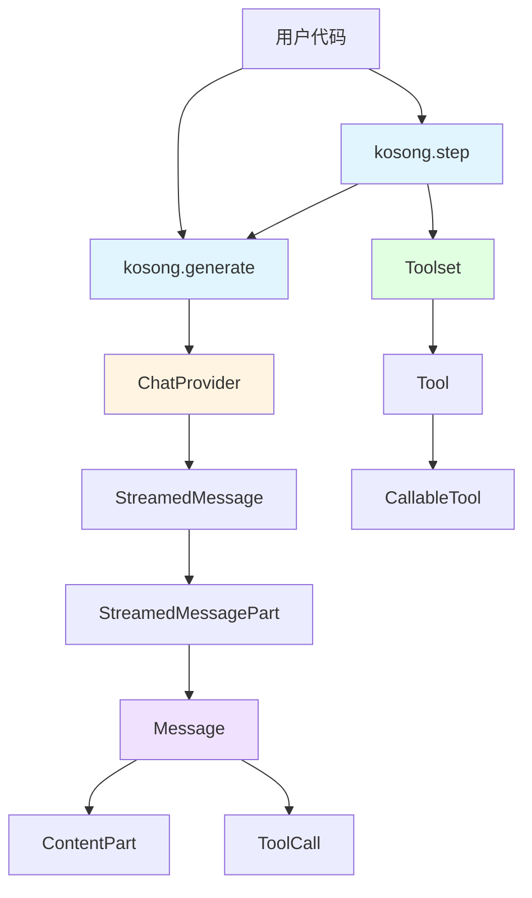
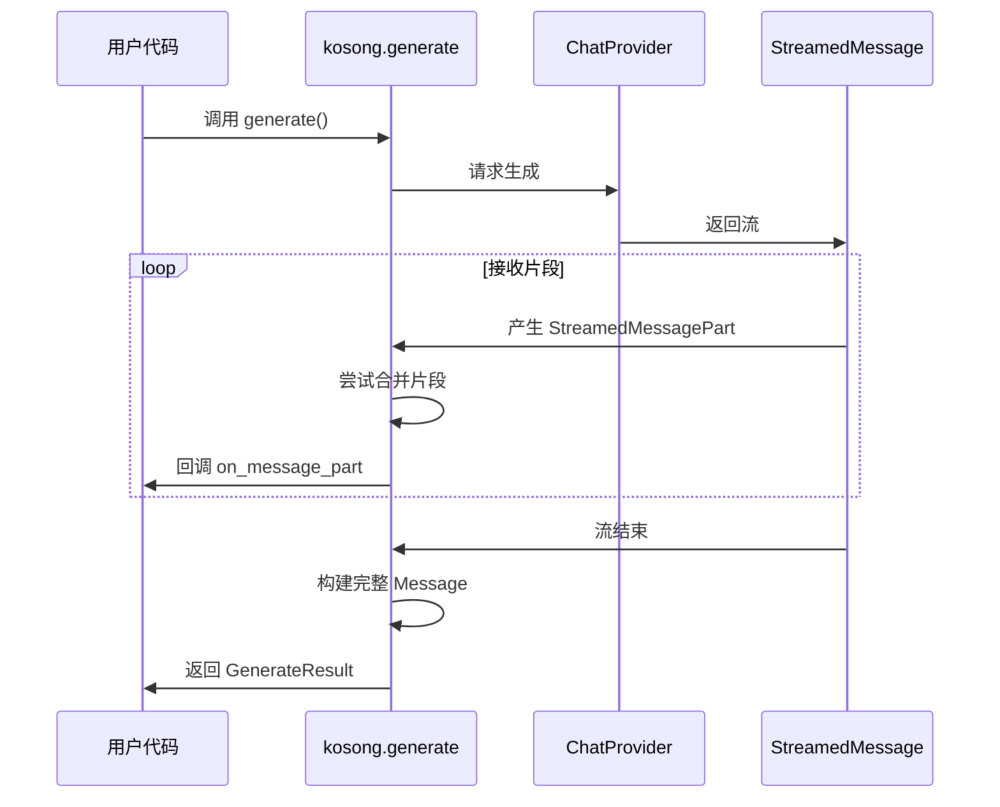
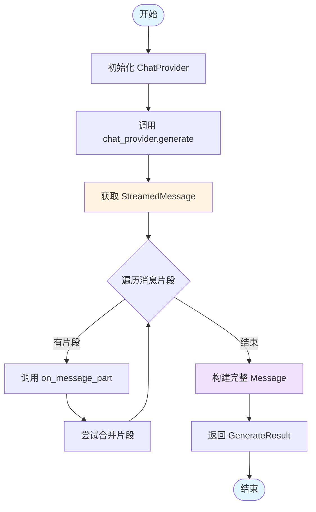
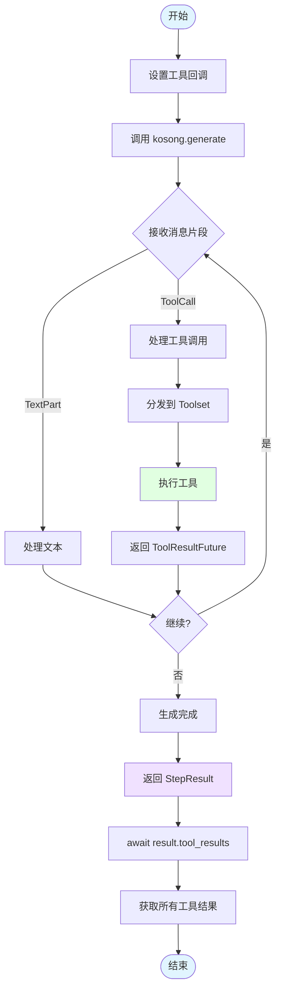
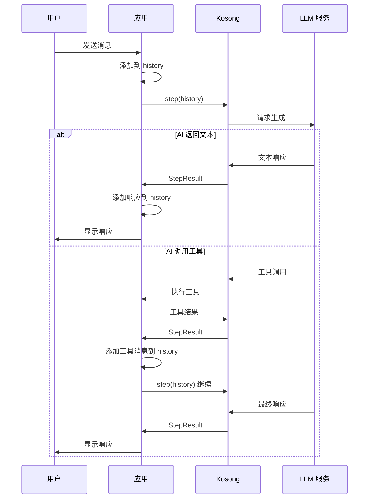

# 核心概念

本文档将帮助你深入理解 Kosong 的核心设计理念和关键组件。掌握这些概念后，你将能够更好地使用 Kosong 构建复杂的 AI Agent 应用。

## Kosong 是什么

Kosong 是一个专为现代 AI Agent 应用设计的 LLM 抽象层框架。它的核心目标是：

- **统一接口**：为不同的 LLM 服务提供商提供统一的调用接口，避免供应商锁定
- **异步优先**：从底层设计就支持异步操作，充分利用 Python 的 async/await 特性
- **工具编排**：提供强大的工具系统，让 AI 能够调用外部函数和服务
- **流式处理**：原生支持流式输出，提供更好的用户体验
- **类型安全**：使用 Pydantic 进行参数验证，确保类型安全

> Kosong 在马来语和印尼语中意为"空"，象征着框架的简洁和灵活性——它不强加特定的架构模式，而是提供基础构建块，让你自由组合。

## 核心组件概览

Kosong 的架构围绕以下核心组件构建：



## Message - 消息结构

### 什么是 Message

`Message` 是 Kosong 中表示对话消息的核心数据结构。它统一了不同 LLM 服务提供商的消息格式，让你可以用一致的方式处理对话历史。

### Message 的结构

一个 `Message` 包含以下关键字段：

- **role**：消息的角色，可以是 `system`、`user`、`assistant` 或 `tool`
- **content**：消息的内容，可以是字符串或 `ContentPart` 列表
- **tool_calls**：AI 请求的工具调用列表（仅 assistant 消息）
- **tool_call_id**：工具调用的 ID（仅 tool 消息）

### ContentPart - 内容片段

消息内容可以包含多种类型的片段：

- **TextPart**：文本内容
- **ThinkPart**：AI 的思考过程（某些模型支持）
- **ImageURLPart**：图片 URL
- **AudioURLPart**：音频 URL

### 代码示例

```python
from kosong.message import Message, TextPart, ImageURLPart

# 简单文本消息
message1 = Message(
    role="user",
    content="你好，请介绍一下你自己。"
)

# 多模态消息（文本 + 图片）
message2 = Message(
    role="user",
    content=[
        TextPart(text="这张图片里有什么？"),
        ImageURLPart(
            image_url=ImageURLPart.ImageURL(
                url="https://example.com/image.png"
            )
        )
    ]
)

# Assistant 消息（带工具调用）
from kosong.message import ToolCall

message3 = Message(
    role="assistant",
    content=[TextPart(text="我来帮你计算。")],
    tool_calls=[
        ToolCall(
            id="call_123",
            function=ToolCall.FunctionBody(
                name="add",
                arguments='{"a": 2, "b": 3}'
            )
        )
    ]
)

# Tool 响应消息
message4 = Message(
    role="tool",
    content="5",
    tool_call_id="call_123"
)
```


## ChatProvider - 聊天提供者

### 什么是 ChatProvider

`ChatProvider` 是 Kosong 对不同 LLM 服务提供商的抽象接口。它定义了统一的方法来与各种 LLM 服务（如 Kimi、OpenAI、Anthropic 等）进行交互。

### ChatProvider 的职责

- **生成响应**：根据系统提示、工具列表和对话历史生成 AI 响应
- **流式输出**：返回 `StreamedMessage` 对象，支持实时接收消息片段
- **模型配置**：管理模型名称、API 密钥、基础 URL 等配置
- **错误处理**：统一处理 API 连接错误、超时、状态码错误等

### 内置的 ChatProvider

Kosong 内置了以下 ChatProvider：

- **Kimi**：月之暗面的 Kimi 模型（`kosong.chat_provider.kimi.Kimi`）
- **OpenAI**（贡献模块）：OpenAI 的 GPT 系列模型
- **Anthropic**（贡献模块）：Anthropic 的 Claude 系列模型

### 代码示例

```python
from kosong.chat_provider.kimi import Kimi

# 初始化 Kimi ChatProvider
kimi = Kimi(
    base_url="https://api.moonshot.ai/v1",
    api_key="your_api_key_here",
    model="kimi-k2-turbo-preview"
)

# ChatProvider 的核心方法
async def example():
    from kosong.message import Message
    
    # generate 方法返回 StreamedMessage
    stream = await kimi.generate(
        system_prompt="你是一个友好的助手。",
        tools=[],
        history=[
            Message(role="user", content="你好！")
        ]
    )
    
    # 遍历流式消息片段
    async for part in stream:
        print(part)
    
    # 获取消息 ID 和 Token 使用情况
    print(f"Message ID: {stream.id}")
    print(f"Token Usage: {stream.usage}")
```

### 自定义 ChatProvider

你可以实现自己的 ChatProvider 来支持其他 LLM 服务。只需实现 `ChatProvider` 协议：

```python
from kosong.chat_provider import ChatProvider, StreamedMessage
from kosong.message import Message
from kosong.tooling import Tool
from collections.abc import Sequence

class MyCustomProvider:
    name: str = "my_provider"
    
    @property
    def model_name(self) -> str:
        return "my-model-v1"
    
    async def generate(
        self,
        system_prompt: str,
        tools: Sequence[Tool],
        history: Sequence[Message],
    ) -> StreamedMessage:
        # 实现你的生成逻辑
        ...
    
    def with_thinking(self, effort):
        return self
```

## Tool / Toolset - 工具系统

### 什么是 Tool

`Tool` 是 AI 可以调用的函数或服务的定义。它包含：

- **name**：工具的名称
- **description**：工具的描述（AI 根据这个决定何时使用）
- **parameters**：工具的参数定义（JSON Schema 格式）

### 什么是 Toolset

`Toolset` 是工具的集合，负责：

- **注册工具**：管理可用的工具列表
- **处理调用**：当 AI 请求调用工具时，执行相应的工具并返回结果

### CallableTool 和 CallableTool2

Kosong 提供两种方式定义可调用的工具：

#### CallableTool

基础的可调用工具，参数可以是任意 JSON 类型：

```python
from kosong.tooling import CallableTool, ToolOk, ToolReturnType

class MyTool(CallableTool):
    name: str = "my_tool"
    description: str = "这是我的工具"
    parameters: dict = {
        "type": "object",
        "properties": {
            "arg1": {"type": "string"},
            "arg2": {"type": "number"}
        },
        "required": ["arg1"]
    }
    
    async def __call__(self, **kwargs) -> ToolReturnType:
        arg1 = kwargs.get("arg1")
        arg2 = kwargs.get("arg2", 0)
        result = f"处理 {arg1} 和 {arg2}"
        return ToolOk(output=result)
```

#### CallableTool2（推荐）

使用 Pydantic 进行类型安全的参数验证：

```python
from pydantic import BaseModel
from kosong.tooling import CallableTool2, ToolOk, ToolReturnType

class CalculateParams(BaseModel):
    operation: str  # "add", "subtract", "multiply", "divide"
    a: float
    b: float

class CalculateTool(CallableTool2[CalculateParams]):
    name: str = "calculate"
    description: str = "执行基本的数学运算"
    params: type[CalculateParams] = CalculateParams
    
    async def __call__(self, params: CalculateParams) -> ToolReturnType:
        match params.operation:
            case "add":
                result = params.a + params.b
            case "subtract":
                result = params.a - params.b
            case "multiply":
                result = params.a * params.b
            case "divide":
                if params.b == 0:
                    from kosong.tooling import ToolError
                    return ToolError(
                        message="除数不能为零",
                        brief="除零错误"
                    )
                result = params.a / params.b
            case _:
                from kosong.tooling import ToolError
                return ToolError(
                    message=f"不支持的运算: {params.operation}",
                    brief="无效运算"
                )
        
        return ToolOk(
            output=f"结果是 {result}",
            brief=f"{params.a} {params.operation} {params.b} = {result}"
        )
```


### SimpleToolset

`SimpleToolset` 是 Kosong 提供的简单工具集实现：

```python
from kosong.tooling.simple import SimpleToolset

# 创建工具集
toolset = SimpleToolset()

# 添加工具
toolset += CalculateTool()
toolset += AnotherTool()

# 获取所有工具定义
tools = toolset.tools  # List[Tool]

# 处理工具调用
from kosong.message import ToolCall

tool_call = ToolCall(
    id="call_123",
    function=ToolCall.FunctionBody(
        name="calculate",
        arguments='{"operation": "add", "a": 5, "b": 3}'
    )
)

# handle 返回 ToolResult 或 ToolResultFuture
result = toolset.handle(tool_call)
```

### 工具返回类型

工具可以返回两种类型：

#### ToolOk - 成功结果

```python
from kosong.tooling import ToolOk

return ToolOk(
    output="这是返回给 AI 的结果",
    message="可选的解释性消息",
    brief="可选的简短摘要（显示给用户）"
)
```

#### ToolError - 错误结果

```python
from kosong.tooling import ToolError

return ToolError(
    output="可选的错误详情",
    message="错误消息（给 AI）",
    brief="简短的错误描述（给用户）"
)
```

## Streaming - 流式处理

### 什么是流式处理

流式处理允许你在 AI 生成响应的过程中实时接收内容片段，而不是等待整个响应生成完成。这提供了更好的用户体验，特别是对于长文本生成。

### StreamedMessage 和 StreamedMessagePart

- **StreamedMessage**：表示一个流式消息，可以异步迭代
- **StreamedMessagePart**：消息的一个片段，可以是：
  - `ContentPart`（如 `TextPart`、`ThinkPart`）
  - `ToolCall`（完整的工具调用）
  - `ToolCallPart`（工具调用的片段）

### 流式处理的工作原理



### 代码示例

#### 基础流式输出

```python
import asyncio
from kosong.chat_provider import StreamedMessagePart
from kosong.message import Message
import kosong
from kosong.chat_provider.kimi import Kimi

async def streaming_example():
    kimi = Kimi(
        base_url="https://api.moonshot.ai/v1",
        api_key="your_api_key_here",
        model="kimi-k2-turbo-preview"
    )
    
    history = [
        Message(role="user", content="请写一首关于春天的诗。")
    ]
    
    # 定义回调函数处理每个消息片段
    def on_part(part: StreamedMessagePart):
        # 实时打印文本片段
        from kosong.message import TextPart
        if isinstance(part, TextPart):
            print(part.text, end="", flush=True)
    
    result = await kosong.generate(
        chat_provider=kimi,
        system_prompt="你是一位诗人。",
        tools=[],
        history=history,
        on_message_part=on_part  # 设置流式回调
    )
    
    print("\n\n完整消息：", result.message)
    print("Token 使用：", result.usage)

asyncio.run(streaming_example())
```

#### 处理工具调用的流式输出

```python
from kosong.message import ToolCall

async def streaming_with_tools():
    # ... 初始化 kimi 和 toolset ...
    
    tool_calls_received = []
    
    def on_part(part: StreamedMessagePart):
        from kosong.message import TextPart
        if isinstance(part, TextPart):
            print(f"[文本] {part.text}")
        elif isinstance(part, ToolCall):
            print(f"[工具调用] {part.function.name}")
    
    async def on_tool_call(tool_call: ToolCall):
        tool_calls_received.append(tool_call)
        print(f"[完整工具调用] {tool_call.function.name}({tool_call.function.arguments})")
    
    result = await kosong.step(
        chat_provider=kimi,
        system_prompt="你是一个助手。",
        toolset=toolset,
        history=history,
        on_message_part=on_part,
        on_tool_result=lambda r: print(f"[工具结果] {r.result}")
    )
```

### 片段合并机制

Kosong 会自动合并相邻的相同类型片段：

- 连续的 `TextPart` 会合并成一个
- 连续的 `ThinkPart` 会合并成一个
- `ToolCallPart` 会逐步合并成完整的 `ToolCall`

这确保了最终的 `Message` 对象是干净和优化的。


## Async - 异步编程

### 为什么使用异步

Kosong 从底层设计就采用异步架构，原因包括：

- **高效的 I/O 操作**：LLM API 调用通常需要几秒钟，异步可以在等待时执行其他任务
- **并发工具执行**：多个工具可以并发执行，提高响应速度
- **流式处理**：异步迭代器天然适合处理流式数据
- **可扩展性**：异步架构更容易扩展到处理多个并发请求

### Kosong 中的异步模式

#### 1. 异步函数调用

所有核心 API 都是异步的：

```python
import asyncio
import kosong
from kosong.chat_provider.kimi import Kimi
from kosong.message import Message

async def main():
    kimi = Kimi(
        base_url="https://api.moonshot.ai/v1",
        api_key="your_api_key_here",
        model="kimi-k2-turbo-preview"
    )
    
    # 使用 await 调用异步函数
    result = await kosong.generate(
        chat_provider=kimi,
        system_prompt="你是一个助手。",
        tools=[],
        history=[Message(role="user", content="你好")]
    )
    
    print(result.message)

# 运行异步主函数
asyncio.run(main())
```

#### 2. 异步迭代器

流式消息使用异步迭代器：

```python
async def stream_example():
    # ... 初始化 kimi ...
    
    stream = await kimi.generate(
        system_prompt="你是一个助手。",
        tools=[],
        history=[Message(role="user", content="讲个故事")]
    )
    
    # 使用 async for 迭代流
    async for part in stream:
        print(part)
```

#### 3. 并发工具执行

`SimpleToolset` 支持并发执行多个工具：

```python
from kosong.tooling import CallableTool2, ToolOk
from pydantic import BaseModel
import asyncio

class SlowToolParams(BaseModel):
    duration: int

class SlowTool(CallableTool2[SlowToolParams]):
    name: str = "slow_tool"
    description: str = "一个需要时间的工具"
    params: type[SlowToolParams] = SlowToolParams
    
    async def __call__(self, params: SlowToolParams) -> ToolOk:
        # 模拟耗时操作
        await asyncio.sleep(params.duration)
        return ToolOk(output=f"等待了 {params.duration} 秒")

# 如果 AI 同时调用多个 SlowTool，它们会并发执行
```

#### 4. 工具结果的异步获取

`StepResult` 的工具结果需要异步获取：

```python
async def step_example():
    # ... 初始化并调用 kosong.step ...
    
    result = await kosong.step(
        chat_provider=kimi,
        system_prompt="你是一个助手。",
        toolset=toolset,
        history=history
    )
    
    # 异步获取工具结果
    tool_results = await result.tool_results()
    
    for tr in tool_results:
        print(f"工具 {tr.tool_call_id}: {tr.result}")
```

### 异步最佳实践

#### 1. 使用 asyncio.run() 启动

```python
import asyncio

async def main():
    # 你的异步代码
    pass

if __name__ == "__main__":
    asyncio.run(main())
```

#### 2. 避免阻塞操作

在异步函数中避免使用阻塞的同步操作：

```python
# ❌ 不好：阻塞操作
async def bad_example():
    import time
    time.sleep(5)  # 阻塞整个事件循环！

# ✅ 好：使用异步版本
async def good_example():
    import asyncio
    await asyncio.sleep(5)  # 不阻塞事件循环
```

#### 3. 并发执行多个任务

```python
async def concurrent_example():
    # 同时调用多个 LLM
    results = await asyncio.gather(
        kosong.generate(kimi, "提示1", [], history1),
        kosong.generate(kimi, "提示2", [], history2),
        kosong.generate(kimi, "提示3", [], history3),
    )
    
    for result in results:
        print(result.message)
```

#### 4. 错误处理

```python
from kosong.chat_provider import ChatProviderError, APITimeoutError

async def error_handling_example():
    try:
        result = await kosong.generate(
            chat_provider=kimi,
            system_prompt="你是一个助手。",
            tools=[],
            history=history
        )
    except APITimeoutError as e:
        print(f"请求超时: {e}")
    except ChatProviderError as e:
        print(f"ChatProvider 错误: {e}")
    except asyncio.CancelledError:
        print("任务被取消")
        raise  # 重新抛出 CancelledError
```

## 核心工作流程

### generate 工作流程

`kosong.generate` 是最基础的 API，用于生成一条 AI 消息：



### step 工作流程

`kosong.step` 在 `generate` 的基础上增加了工具处理：



### 多轮对话工作流程



## 下一步

现在你已经理解了 Kosong 的核心概念，可以：

- 查阅 [API 参考文档](./api-reference/README.md) 了解详细的 API 说明
- 阅读 [实践指南](./guides/README.md) 学习实际应用场景
- 探索 [高级主题](./advanced/README.md) 深入了解框架内部实现
- 查看 [架构设计文档](./architecture.md) 理解整体架构

如有疑问，欢迎查阅文档或在社区提问！
